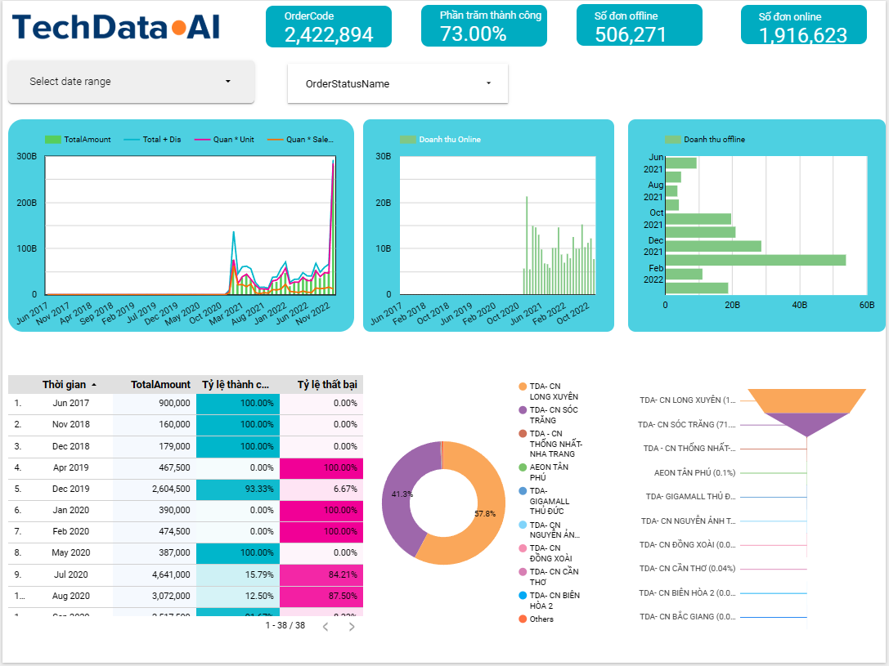

# Data Engineering End-to-End Project

This project demonstrates an end-to-end **data pipeline** for analytics using a 10GB SQL Server database.

## Architecture
- **Airflow (Docker)** for pipeline orchestration  
- **SQL Server** as the source system  
- **Google BigQuery** as the data warehouse  
- **Looker Studio** for reporting & visualization  

## Pipeline Flow
1. Extracted ~10GB data from SQL Server  
2. Loaded raw data into Google BigQuery  
3. Designed fact & dimension models for analytics  
4. Built interactive dashboards in Looker Studio  

## Tech Stack
Airflow · Docker · SQL Server · BigQuery · Looker Studio

## Dashboard

